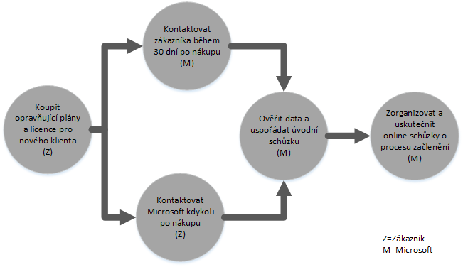
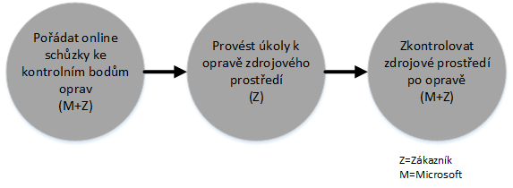
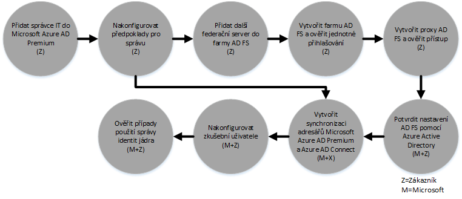

# Proces z&#237;sk&#225;n&#237; benefitu Centra FastTrack pro Azure Rights Management
Pokud má vaše organizace nárok na benefit Centra FastTrack pro Microsoft Azure Rights Management, můžete vzdáleně pracovat se specialisty Microsoftu a připravit prostředí Azure RMS k použití. Informace o způsobilosti svojí organizace najdete v článku [Benefit Centra FastTrack pro Azure Rights Management](../Topic/FastTrack_Center_Benefit_for_Azure_Rights_Management.md).

Tento článek obsahuje následující informace:

-   [Overview of the onboarding process](#overview_rms)

-   [Expectations for your source environment](#expectations_src_environ_rms)

-   [Phases of the onboarding process](#phases_onboarding_process_rms)

-   [Microsoft responsibilities](#microsoft_responsibilities_rms) pro každou fázi

-   [Your responsibilities](#your_responsibilities_rms) pro každou fázi

Po dokončení registrace můžete očekávat:

-   Je vytvořený váš klient Microsoft Azure RMS.

-   Licencovaní uživatelé mají přístup ke službám Azure RMS pomocí jedné z následujících možností identity:

    -   Cloudové identity (jedinečné účty Microsoft Azure AD)

    -   Synchronizované identity: Účty Microsoft Azure AD synchronizované z vašeho místního adresáře Active Directory pomocí nástroje Azure Active Directory Connect (Azure AD Connect) pro zákazníky s jednou nebo více doménovými strukturami Active Directory

    -   Federované identity – s účty Microsoft Azure AD, které jsou:

        -   Synchronizované z Active Directory pomocí nástroje Microsoft Azure AD Connect pro zákazníky s konfigurací jedné doménové struktury Active Directory

        -   Federované se službou AD FS (Active Directory Federation Services) 2.0 nebo novější z vašeho místního adresáře Active Directory

## Přehled procesu registrace
Registraci tvoří dvě hlavní součásti:

-   **Základní možnosti** – úkoly vyžadované pro konfiguraci klienta a integraci s Azure AD (v případě potřeby). Základní možnosti poskytují i standardní hodnoty pro registraci jiných oprávněných služeb Microsoft Online.

-   **Registrace služeb** – úkoly vyžadované ke konfiguraci Azure RMS samostatně nebo se synchronizací adresářů Azure AD Connect nebo s AD FS

Následující diagram popisuje časovou osu pro používání benefitu Centra FastTrack.

Základní proces je tento:

-   Společnost Microsoft se pokusí vás kontaktovat do 30 dní od data, kdy jste si koupili oprávněný plán. Pokud jste připravení tyto služby ve své organizaci nasadit, můžete [Centrum FastTrack](http://fasttrack.microsoft.com/) požádat o pomoc. Pokud chcete požádat o pomoc, přihlaste se k Centru FastTrack (http://fasttrack.microsoft.com), přejděte na řídicí panel, vyberte název společnosti, klikněte na kartu Nabídky a klikněte na tlačítko pro žádost o pomoc k oprávněné službě.

-   Tým Microsoftu vám pomůže se základními možnostmi a potom taky s jednou registrací u každé oprávněné služby.

Veškerou podporu registrace budou vzdáleně poskytovat zaměstnanci Microsoftu:

-   Microsoft vám bude vzdáleně pomáhat s různými aktivitami při registraci prostřednictvím nástrojů, dokumentace a pokynů. Pokud chcete, aby Microsoft dělal určité konfigurační úkony za vás, můžete se rozhodnout společnosti Microsoft udělit příslušná oprávnění a přístupová práva k jejich provádění.

-   Podporu registrace poskytuje Centrum FastTrack, které je dostupné v běžné pracovní době pro příslušnou oblast.

-   Podpora registrace je dostupná v angličtině, tradiční čínštině, francouzštině, italštině, japonštině, němčina, portugalštině (Brazílie) nebo španělštině.

-   Tým Microsoftu může spolupracovat přímo s vámi nebo vaším zástupcem – jak budete chtít.

## Očekávání pro vaše zdrojové prostředí
Ve svém místním zdrojovém prostředí už můžete mít adresář Microsoft Active Directory, který chcete integrovat s Microsoft Azure Active Directory a využívat tak bohaté možnosti správy identit z jediné konzoly. Součástí benefitu Centra FastTrack je taky to, že vám pomůžeme integrovat si Microsoft Azure Active Directory s vaší stávající místní implementací. Pokud se integrace požaduje, musí vaše zdrojové prostředí splňovat určitou minimální úroveň stanovenou pro příslušnou aplikaci.

Následující tabulka ukazuje, jaké se pro registraci očekávají minimální úrovně zdrojového prostředí.

|Aktivita|Očekávané zdrojové prostředí|
|------------|--------------------------------|
|Základní možnosti|Doménové struktury služby Active Directory s úrovní funkčnosti doménové struktury nastavenou na Windows Server 2008 nebo vyšší, s následující konfigurací doménovou struktury:  -   Jedna doménová struktura služby Active Directory -   Více doménových struktur služby Active Directory **Note:** U všech konfigurací s více doménovými strukturami se benefit Centra FastTrack nevztahuje na nasazení služby AD FS.|
|Registrace služby  -   Azure RMS|Místní adresář Active Directory a prostředí jsou připravené na Azure RMS, ve kterém už jsou vyřešené zjištěné problémy, které by jinak znemožňovaly integraci s funkcemi Azure AD a Azure RMS.|

## Fáze procesu registrace
Registrace Azure RMS má pět primárních fází, jak je vidět na následujícím obrázku:

-   Inicializace

-   Hodnocení

-   Opravy

-   Povolení

-   Zavřít

Podrobný popis úkolů jednotlivých fází najdete v částech [Microsoft responsibilities](#microsoft_responsibilities_rms) a [Your responsibilities](#your_responsibilities_rms).

### Fáze inicializace
Po nákupu příslušného počtu licencí přiřaďte licence ke stávajícímu nebo novému klientovi podle pokynů uvedených v e-mailu s potvrzením nákupu. Microsoft ověří, jestli splňujete podmínky pro benefit Centra FastTrack. Společnost Microsoft se pokusí vás kontaktovat do 30 dní od data, kdy jste si koupili oprávněný plán. Pokud jste připravení tyto služby ve své organizaci nasadit, můžete [Centrum FastTrack](http://fasttrack.microsoft.com/) požádat o pomoc. Pokud chcete požádat o pomoc, přihlaste se k Centru FastTrack (http://fasttrack.microsoft.com), přejděte na řídicí panel, vyberte název společnosti, klikněte na kartu Nabídky a klikněte na tlačítko pro žádost o pomoc k oprávněné službě.

V průběhu této fáze se budeme zabývat procesem registrace, ověřovat data a nastavíme zahajovací schůzku.

### Fáze hodnocení
Po zahájení procesu registrace s vámi bude Microsoft spolupracovat na vyhodnocení vašeho zdrojového prostředí a odpovídajících požadavků. Spustí se nástroje vyhodnocující vaše prostředí a Microsoft vás provede hodnocením vašich internetových prohlížečů, adresáře Active Directory, klientských operačních systémů v zařízeních, DNS, sítě, infrastruktury a systému identit, podle kterého určí, jestli je pro registraci potřeba udělat nějaké změny. Na základě vašeho aktuální nastavení vám nabídneme plán oprav, kterými zajistíte splnění minimálních požadavků na zdrojové prostředí pro úspěšnou registraci Azure RMS. Pro fázi oprav taky nastavíme vhodná volání kontrolních bodů.

### Fáze oprav
V případě potřeby uděláte ve svém zdrojovém prostředí úkoly určené v plánu oprav, tak aby se splnily požadavky pro registraci jednotlivých služeb.

Před zahájením fáze povolení společně ověříme výstupy opravných aktivit a ujistíme se, že můžete pokračovat.

### Fáze povolení
Po dokončení všech opravných aktivit se projekt posune ke konfiguraci základní infrastruktury pro používání služby a zřízení Azure RMS.

**Fáze povolení – základní možnosti**

Povolení základních možností zahrnuje zřízení služby a integraci klienta a identit. Její součástí jsou i kroky pro zajištění základních podmínek registrace Microsoft Azure RMS.

Registrace pro Azure RMS může začít až po dokončení základní registrace.

**Fáze povolení – Azure RMS**

Prostředí Azure RMS se dá nastavit se synchronizací adresářů Azure AD Connect a službou Active Directory Federation Services (AD FS), jak je potřeba.

Pro scénáře Azure RMS, které zahrnují synchronizaci místních identit do cloudu, vám pomůžeme přidáním IT správců a uživatelů do vašeho předplatného, konfigurací požadavků na správu, nastavením Azure RMS, nastavením synchronizace adresářů přes Azure AD Connect a služby Active Directory Federation Services přes Azure AD Connect, přičemž nakonfigurujeme testovací uživatele a ověříme vaše základní případy používání pro službu.

Nastavení Azure RMS zahrnuje povolení těchto funkcí:

-   Povolení služby RMS

-   Konfigurace IRM pro Exchange Online a Sharepoint Online

-   Rights Management Connector s místním nasazením Exchange a místním Sharepointem

-   Aplikace Sdílení RMS pro zařízení s Windows nebo s jinými systémy

## Odpovědnosti Microsoftu

### Obecné

-   Poskytovat vám vzdálenou podporu při požadovaných konfiguračních aktivitách popsaných u jednotlivých fází

-   Poskytovat dostupnou dokumentaci a softwarové nástroje, konzoly pro správu a skripty, které vám pomůžou omezit nebo odstranit úkoly konfigurace.

Poskytování oprávnění a přístupových práv společnosti Microsoft není k využití benefitu Centra FastTrack nutné. V některých případech se můžete rozhodnout dát společnosti Microsoft odpovídající oprávnění a přístupová práva, aby mohla vaším jménem provádět konkrétní aktivity.

### Fáze inicializace

-   Kontaktovat vás do 30 dnů od zakoupení opravňujících licencí pro nového klienta

-   Definovat opravňující služby, které se budou registrovat

### Fáze hodnocení

-   Poskytovat přehled pro správu

-   Poskytovat pokyny k:

    -   Řešení požadavků na DNS, síť a infrastrukturu

    -   Řešení požadavků na klienta (internetový prohlížeč, klientské operační systémy a služby)

    -   Identitě a zřizování uživatelů

    -   Identifikaci požadavků na  synchronizaci adresářů

    -   Povolení oprávněných služeb, které jste zakoupili a určili jako součást registrace

    -   Zjištění nutných požadavků pilotního a testovacího prostředí

-   Stanovit časovou osu pro opravné aktivity

-   Poskytovat kontrolní seznam oprav

### Fáze oprav

-   Zařídit konferenční hovory podle odsouhlaseného plánu, při kterých s vámi bude probírat postup opravných aktivit

-   Pomáhat se spouštěním nástrojů k ručení a opravám problémů a s interpretací výsledků

### Fáze povolení
Poskytovat pokyny k:

-   Aktivaci vašeho klienta Azure RMS

-   Konfiguraci portů brány firewall

-   Konfiguraci DNS pro oprávněné služby

-   Ověření připojení ke službám Azure RMS

-   Pro prostředí s jednou doménovou strukturou:

    -   Instalaci synchronizace adresářů mezi službami Active Directory Domain Services (AD DS) a Azure AD Connect (v případě potřeby)

    -   Konfiguraci synchronizace hesel pomocí nástroje Microsoft Azure AD Connect

-   Pro prostředí s více doménovými strukturami:

    -   Instalaci synchronizace Azure AD Connect, nastavení pro více scénářů doménové struktury Poznámka: Funkce synchronizace hodnot hash hesel a zpětný zápis hesel podporují více doménových struktur.  Scénáře zpětného zápisu ale podporované nejsou.

    -   Konfiguraci synchronizace mezi místními doménovými strukturami Active Directory a adresářem Microsoft Azure AD (Azure Active Directory)

        > [!NOTE]
        > K vývoji a implementaci rozšíření vlastních pravidel se pokyny neposkytují.

-   U jedné doménové struktury, pokud jsou cílem federované identity: Instalaci a konfiguraci služby AD FS (Active Directory Federation Services) pro ověřování v místní doméně s Microsoft Azure AD v konfiguraci s jednou lokalitou odolné proti chybám (v případě potřeby).

    > [!NOTE]
    > U všech konfigurací s více doménovými strukturami se k nasazení služby AD FS pokyny neposkytují.

-   Testování funkce jednotného přihlašování, pokud je nasazená

-   Přidání dalších informací pro správce zabezpečení ke správě šablon

-   Přiřazení účtu superuživatele k Azure RMS

-   Licencování dvou pilotních uživatelů pro Azure RMS

-   Konfigurace dvou testovacích distribučních skupin pro ověření zásad

-   Konfigurace jedné vlastní šablony Azure RMS pro adresář

-   Poskytnutí pokynů k nastavení integrace SharePointu Online a Exchange Online s RMS, včetně:

    -   Konfigurace a ověření integrace Exchange Online s Azure RMS

    -   Vytvoření jednoho testovacího pravidla toku pošty pro šifrování citlivých zpráv posílaných příjemcům mimo vaši organizaci

    -   Konfigurace a ověření ochrany SharePointu Online s jednou testovací knihovnou chráněnou pomocí Azure RMS

-   Konfigurace jednoho serveru v místním nasazení se službou RMS Connector (v případě potřeby):

    -   Konfigurace a ověření integrace Exchange 2013/2010 v místním nasazení s Azure RMS

    -   Vytvoření jednoho testovacího pravidla toku pošty pro šifrování citlivých zpráv posílaných příjemcům mimo vaši organizaci pomocí služby Connector

    -   Konfigurace a ověření místní ochrany SharePointu 2013/2010 s jednou testovací knihovnou chráněnou pomocí Azure RMS

-   Nastavení aplikace Sdílení RMS pro zařízení s Windows nebo s jinými systémy

## Vaše odpovědnosti
Tato část popisuje některé vaše odpovědnosti během procesu registrace.

### Obecné

-   Vylepšení a integrace v rámci klienta Azure RMS nad rámec konfigurovatelných možností, které jsou uvedené v tomto článku

-   Celkový program a řízení projektů vašich prostředků

-   Komunikace s koncovými uživateli, dokumentace, školení a správa změn

-   Dokumentace technické podpory a školení

-   Vytváření všech sestav, prezentací nebo zápisů ze schůzek, které jsou specifické pro vaši organizaci

-   Vytváření dokumentace architektury a technické dokumentace specifické pro vaši organizaci

-   Návrh, nákup, instalace a konfigurace hardwaru a sítě

-   Nákup, instalace a konfigurace softwaru

-   Správa, konfigurace a použití zásad zabezpečení nad rámec těch, které se vytvořily pro testování vašich standardních funkcí a konfigurace služeb Azure RMS

-   Registrace uživatelských účtů nad rámec těch, které se použily k testování vašich standardních funkcí a konfigurace služeb Azure RMS

-   Konfigurace sítě, analýza ověření šířky pásma, testování a monitorování

-   Správa procesu schválení řízení technických změn a vytváření podpůrné dokumentace

-   Úprava provozního modelu a provozní příručky

-   Vyřazení zdrojových prostředí a služeb dříve využívaných zákazníkem z provozu a jejich odebrání

-   Vytváření a údržba testovacího prostředí

-   Instalace aktualizací Service Pack a dalších požadovaných aktualizací serverů infrastruktury

-   Poskytování a konfigurace všech veřejných certifikátů protokolu SSL

-   Vytvoření Podmínek použití organizace příkazů pro konfiguraci a zobrazení na zařízeních vlastněných koncovými uživateli

### Fáze inicializace

-   Spolupráce s týmem Microsoftu na zahájení registrace oprávněných služeb

-   Účastnit se zahajovací schůzky, řídit a vést účastníky z vaší organizace a potvrdit časové plány oprav

### Fáze hodnocení

-   Určit příslušné účastníky (včetně vedoucího projektu) pro zajištění nutných aktivit hodnocení

-   Pokud si zvolíte takovou možnost, sdílet svou obrazovku s Microsoftem v případě potřeby pokynů pro spuštění nástrojů vyhodnocujících vaše prostředí nebo předplatné Azure RMS

-   Účastnit se schůzek, na kterých se vytvoří kontrolní seznam oprav, a přispívat k celkovému plánu, včetně infrastruktury, sítě, správy, přípravě synchronizace adresáře, zabezpečení sítě a témat federovaných identit.

-   Účastnit se schůzek, na kterých se vymezí přístup k zřizování uživatelů

-   Účastnit se schůzek plánujících konfiguraci online služeb

-   Vytvořit plán podpory pro přípravu migrace

### Fáze oprav

-   Provést požadované kroky k dokončení aktivit oprav stanovených ve fázi hodnocení

-   Účastnit schůzek kontrolního bodů

### Fáze povolení

-   Pokud si zvolíte takovou možnost, sdílet svou obrazovku s Microsoftem v případě potřeby pokynů pro změny prostředí nebo předplatné Azure RMS

-   Spravovat prostředky podle potřeby

-   Konfigurovat síťové položky podle pokynů od Microsoftu

-   Provádět synchronizaci připravenosti adresářů a konfigurace adresářů podle pokynů od Microsoftu

-   Konfigurovat infrastrukturu zabezpečení (třeba portů brány firewall) podle pokynů od Microsoftu

-   Implementovat infrastrukturu příslušného klienta

-   Implementovat přístup k zřizování uživatelů podle pokynů od Microsoftu

-   Povolovat různé služby podle pokynů od Microsoftu

## Chcete se dozvědět víc?
Podívejte se na články [Microsoft Azure Rights Management](http://products.office.com/business/microsoft-azure-rights-management) a [Enterprise Mobility Suite](http://www.microsoft.com/en-us/server-cloud/products/enterprise-mobility-suite/default.aspx).

