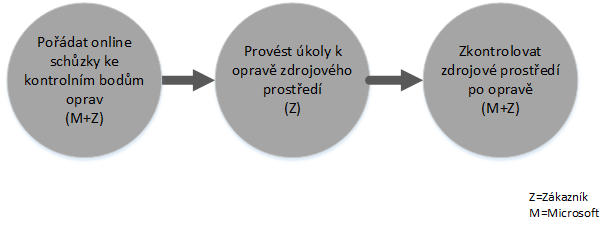

# Proces z&#237;sk&#225;n&#237; benefitu Centra FastTrack pro Intune
Pokud má vaše organizace nárok na získání benefitu služeb Microsoft Intune, můžete vzdáleně pracovat se specialisty Microsoftu a připravit prostředí Microsoft Intune k použití.

Microsoft Intune je součástí sady Enterprise Mobility Suite (EMS) od Microsoftu, která poskytuje funkce EMM (Enterprise Mobility Management), včetně správy mobilních zařízení (MDM) a správy mobilních aplikací (MAM).  Pomocí Microsoft Intune můžete zajistit produktivitu svých zaměstnanců při používání mobilních zařízení, a to zřizováním zařízení a jejich konfigurací a nasazováním mobilních aplikací.  Kromě toho můžete Microsoft Intune využít k ochraně podnikových dat monitorováním kompatibility zařízení, ochranou mobilních aplikací a dat a integrací s Azure AD při kontrole přístupu k podnikovým službám.

Informace o tom, jestli má vaše organizace na získání tohoto benefitu nárok, najdete v článku [Výhody Centra FastTrack pro Intune](../Topic/FastTrack_Center_Benefit_for_Intune.md). Pokud vás zajímá příprava prostředí pro jiné služby sady Enterprise Mobility Suite, přečtěte si článek [Benefit Centra FastTrack pro sadu Enterprise Mobility](../Topic/FastTrack_Center_Benefit_for_Enterprise_Mobility_Suite.md).

**Hledáte informace o Microsoft FastTracku pro Office 365? Přečtěte si článek**  [Výhody Centra FastTrack pro Office 365](https://technet.microsoft.com/library/office-365-onboarding-benefit.aspx).

Tento článek obsahuje následující informace o benefitech služeb pro Microsoft Intune:

-   [Overview of the onboarding process](#overview_onboarding_process)

-   [Expectations for your source environment](#expectations_src_environ)

-   [Phases of the onboarding process](#phases_onboarding_process)

-   [Microsoft responsibilities](#microsoft_responsibilities) pro každou fázi

-   [Your responsibilities](#your_responsibilities) pro každou fázi

Po dokončení registrace můžete očekávat:

-   Vytvoří se klient služby Microsoft Online Service.

-   Licencovaní uživatelé mají přístup ke službě Microsoft Intune pomocí jedné z následujících možností identity:

    -   Cloudové identity (jedinečné účty online služeb Microsoft).

    -   Synchronizované identity: Účty Microsoft Intune synchronizované z vašeho místního adresáře Active Directory přes Azure Active Directory Connect (synchronizační služby):

        -   Pro zákazníky s prostředím s jednou doménovou strukturou Active Directory

        -   Pro zákazníky s podporovanou topologií více doménových struktur služby Active Directory

-   Federované identity – účty Microsoft Intune:

    -   Synchronizované z Active Directory pomocí nástroje Microsoft Azure Active Directory Connect pro zákazníky s konfigurací jedné doménové struktury Active Directory nebo pro zákazníky s jednou doménovou strukturou účtů Active Directory (označuje se také jako „doménová struktura přihlašovacích účtů“) a konfigurací jedné doménové struktury prostředků Active Directory

    -   Federované s rolí Windows Server 2012 R2 Active Directory Federation Services z vašeho místního adresáře Active Directory nebo federované se službou AD FS (Active Directory Federation Services) 2.0 nebo novější z vašeho místního adresáře Active Directory

## Přehled procesu registrace
Registraci tvoří dvě hlavní součásti:

-   **Základní možnosti** – úkoly vyžadované pro konfiguraci klienta a integraci s Azure AD (v případě potřeby). Součást základních možností poskytuje i standardní hodnoty pro registraci jiných oprávněných služeb.

-   **Registrace služby** – úkoly vyžadované ke konfiguraci Microsoft Intune.

Následující diagram popisuje posloupnost událostí pro používání benefitu Centra FastTrack.

Základní proces je tento:

-   Centrum FastTrack se pokusí vás kontaktovat do 30 dní od data, kdy jste si koupili opravňující plán. Pokud jste připravení tyto služby ve své organizaci nasadit, můžete [Centrum FastTrack](http://fasttrack.microsoft.com/) požádat o pomoc. Pokud chcete požádat o pomoc, přihlaste se k [centru FastTrack](http://fasttrack.microsoft.com/), přejděte na řídicí panel, vyberte název společnosti, klikněte na kartu Nabídky a kliknutím na tlačítko Požádat o pomoc si vyžádejte pomoc k Microsoft Intune, Azure Active Directory Premium nebo Azure Rights Management Premium.

-   Centrum FastTrack vám pomůže se základními funkcemi a taky s jednou registrací u každé oprávněné služby.

Veškerou podporu registrace budou vzdáleně poskytovat zaměstnanci Microsoftu:

-   Microsoft vám bude vzdáleně pomáhat s různými aktivitami při registraci prostřednictvím nástrojů, dokumentace a pokynů.

-   Podporu registrace poskytuje Centrum FastTrack, které je dostupné v běžné pracovní době pro příslušnou oblast.

-   Podpora registrace je dostupná v angličtině, tradiční čínštině, francouzštině, italštině, japonštině, němčina, portugalštině (Brazílie) nebo španělštině.

-   Tým Microsoftu může spolupracovat přímo s vámi nebo vaším zástupcem.

## Očekávání pro vaše zdrojové prostředí
Ve svém zdrojovém prostředí už pravděpodobně máte služby, které chcete přesunout do služby Microsoft Intune nebo s ní integrovat. U některých služeb benefit Centra FastTrack pro Intune zahrnuje možnost využít pomoci při nastavování určité úrovně integrace se zdrojovým prostředím. Pokud se integrace požaduje, musí zdrojové prostředí splňovat určitou minimální úroveň stanovenou pro příslušnou aplikaci.

Následující tabulka ukazuje, jaké se pro registraci očekávají minimální úrovně zdrojového prostředí.

|Aktivita|Očekávané zdrojové prostředí|
|------------|--------------------------------|
|Základní možnosti|Doménové struktury služby Active Directory s úrovní funkčnosti doménové struktury nastavenou na Windows Server 2008 nebo vyšší, s následující konfigurací doménovou struktury:  -   Jedna doménová struktura služby Active Directory -   Více doménových struktur služby Active Directory **Note:** U všech konfigurací s více doménovými strukturami se benefit Centra FastTrack nevztahuje na nasazení služby AD FS.|
|Registrace služby  -   Microsoft Intune -   Microsoft Intune integrovaný s nástrojem System Center Configuration Manager|Pro správu zařízení pomocí System Center Configuration Manageru 2012 R2 nebo novější verze s Microsoft Intune musí správci IT použít postup popsaný v článku [Kontrolní seznam správce: Konfigurace Configuration Manageru pro správu mobilních zařízení pomocí Microsoft Intune](https://technet.microsoft.com/library/jj943763.aspx). **Note:** Součástí benefitu služeb není pomoc při nastavení nebo upgradu System Center Configuration Manageru pro splnění minimálních požadavků potřebných pro integraci Microsoft Intune se System Center Configuration Managerem.|

## Fáze procesu registrace
Registrace má čtyři primární fáze:

-   Inicializace

-   Hodnocení

-   Opravy

-   Povolení

Podrobný popis úkolů jednotlivých fází najdete v částech [Microsoft responsibilities](#microsoft_responsibilities) a [Your responsibilities](#your_responsibilities).

### Fáze inicializace
Po nákupu příslušného počtu a typů licencí přiřaďte licence ke stávajícímu nebo novému klientovi podle pokynů uvedených v e-mailu s potvrzením nákupu. Centrum FastTrack ověří, jestli splňujete podmínky pro benefit služeb. Společnost Microsoft se pokusí vás kontaktovat do 30 dní od data, kdy jste si koupili oprávněný plán. Pokud jste připravení tyto služby ve své organizaci nasadit, můžete [Centrum FastTrack](http://fasttrack.microsoft.com/) požádat o pomoc. Pokud chcete požádat o pomoc, přihlaste se k [centru FastTrack](http://fasttrack.microsoft.com/), přejděte na řídicí panel, vyberte název společnosti, klikněte na kartu Nabídky a kliknutím na tlačítko Požádat o pomoc si vyžádejte pomoc k Microsoft Intune, Azure Active Directory Premium nebo Azure Rights Management Premium.

V průběhu této fáze se budeme zabývat procesem registrace, ověřovat data a nastavíme zahajovací schůzku.

### Fáze hodnocení
Po zahájení procesu registrace s vámi bude Microsoft spolupracovat na vyhodnocení vašeho zdrojového prostředí a odpovídajících požadavků. Spustí se nástroje vyhodnocující vaše prostředí a Microsoft vás provede hodnocením vašich internetových prohlížečů, klientských operačních systémů, DNS, sítě, infrastruktury a systému identit, podle kterého určí, jestli je pro registraci potřeba udělat nějaké změny. Na základě vašeho aktuální nastavení vám nabídneme plán oprav, kterými zajistíte splnění minimálních požadavků na zdrojové prostředí pro úspěšnou registraci Microsoft Intune. Pro fázi oprav taky nastavíme vhodná volání kontrolních bodů.

### Fáze oprav
V případě potřeby uděláte ve svém zdrojovém prostředí úkoly určené v plánu oprav, tak aby se splnily požadavky pro registraci jednotlivých služeb.

Před zahájením fáze povolení společně ověříme výstupy opravných aktivit a ujistíme se, že můžete pokračovat.

### Fáze povolení
Po dokončení všech opravných aktivit se projekt posune ke konfiguraci základní infrastruktury pro používání služby a zřízení Microsoft Intune.

**Fáze povolení – základní možnosti**

Povolení základních možností zahrnuje zřízení služby a integraci klienta a identit. Její součástí jsou i kroky pro zřízení základních podmínek registrace Microsoft Intune.

Registrace pro Microsoft Intune může začít až po dokončení povolení základních možností.

**Fáze povolení – Microsoft Intune**

Na základě potřeb vašeho mobilního zařízení a mobilních aplikací vás provedeme přípravou před použitím Microsoft Intune ke správě zařízení. Přesný postup závisí na vašem zdrojové prostředí a jeho součástí může být:

-   Licencování koncových uživatelů Pokud to budete potřebovat, pomůžeme vám taky s postupem aktivace multilicencí pro klienta cloudových služeb Microsoftu.

-   Konfigurace identit, které bude využívat Microsoft Intune, s využitím místní služby Active Directory nebo cloudových identit

-   Přidání uživatelů k odběru Microsoft Intune, definování rolí správce IT a vytvoření skupin uživatelů a zařízení

-   Konfigurace autority pro správu mobilních zařízení na základě vašich potřeb:

    -   Pokud je Microsoft Intune jediným řešením MDM nebo se používá současně se správou mobilních zařízení pro Office 365, nastavte Microsoft Intune jako autoritu MDM.

    -   Pokud máte stávající implementaci System Center Configuration Manageru a chcete rozšířit možnosti správy pomocí Microsoft Intune, jako autoritu MDM nastavte Configuration Manager.

        > [!NOTE]
        > Pokud ale chcete jenom využít správu mobilních aplikací pro zařízení, která vlastní koncoví uživatelé, pro sdílená zařízení nebo pro zařízení typu veřejní terminál, nastavení autority MDM se nevyžaduje.

-   Pokud se zaměřujete na správu mobilních zařízení, poskytujeme pokyny pro následující akce:

    -   Konfigurace testovacích skupin, které se použijí k ověření zásad správy MDM

    -   Konfigurace služeb a zásady správy MDM, jako je:

        -   Nasazení aplikací pro všechny podporované platformy prostřednictvím webových nebo přímých odkazů

        -   Zásady podmíněného přístupu

        -   Nasazení e-mailových profilů

        -   Nastavení konektoru Microsoft Intune Exchange Connector (pokud se používá)

    -   Registrace až dvou testovacích zařízení pro každou z [podporovaných platforem](https://technet.microsoft.com/library/dn600287.aspx) v Microsoft Intune nebo Configuration Manageru pomocí služby Microsoft Intune.

    -   Použití inventárních sestav softwaru a hardwaru

-   Pokud se zaměřujete na správu mobilních aplikací (MAM) nebo pokud chcete stávající řešení MDM od Microsoftu nebo jiných výrobců doplnit o zásady MDM, poskytujeme pokyny pro následující akce:

    -   Konfigurace zásad MAM pro všechny podporované platformy

    -   Konfigurace zásad podmíněného přístupu pro spravované aplikace

    -   Cílení na odpovídající skupiny uživatelů pomocí zásad MAM uvedených výš

    -   Využití sestav využití spravovaných aplikací

-   Pokud se zaměřujete na správu počítačů, poskytujeme pokyny pro následující akce:

    -   V případě potřeby instalace klientského softwaru Intune

    -   Využití  inventárních sestav softwaru a hardwaru, které jsou dostupné v Intune

## Odpovědnosti Microsoftu
Tato část popisuje některé odpovědnosti Microsoftu během procesu registrace.

### Obecné

-   Poskytovat vzdálenou podporu při požadovaných konfiguračních aktivitách popsaných u jednotlivých fází

-   Poskytovat dostupnou dokumentaci a softwarové nástroje, konzoly pro správu a skripty, které vám pomůžou omezit nebo odstranit úkoly konfigurace.

### Fáze inicializace

-   Kontaktovat vás do 30 dnů od zakoupení opravňujících licencí pro nového klienta

-   Spolupracovat s vámi před zahájením registrace

-   Definovat opravňující služby, které se budou registrovat

### Fáze hodnocení

-   Poskytovat přehled pro správu

-   Poskytovat pokyny k:

    -   Řešení požadavků na DNS, síť a infrastrukturu

    -   Řešení požadavků na klienta (internetový prohlížeč, klientské operační systémy a služby)

    -   Identitě a zřizování uživatelů

    -   Povolení oprávněných služeb, které jste zakoupili a určili jako součást registrace

-   Stanovit časovou osu pro opravné aktivity

-   Poskytovat kontrolní seznam oprav

### Fáze oprav

-   Zařídit konferenční hovory podle odsouhlaseného plánu, při kterých s vámi bude probírat postup opravných aktivit

-   Pomáhat se spouštěním nástrojů k ručení a opravám problémů a s interpretací výsledků

### Fáze povolení
Poskytovat pokyny k:

-   Aktivaci vašeho klienta online služby Microsoftu

-   Konfiguraci protokolů TCP/IP a portům brány firewall

-   Konfiguraci DNS pro oprávněné služby

-   Ověření připojení ke online službám Microsoftu

-   Pro prostředí s jednou doménovou strukturou:

    -   Instalaci serveru pro synchronizaci adresářů mezi službou AD DS (Active Directory Domain Services) a oprávněnými online službami Microsoftu (v případě potřeby)

    -   Konfiguraci synchronizace hesel (hodnota hash hesel) s Microsoft Intune (Azure Active Directory) pomocí nástroje Azure Active Directory Connect

        > [!NOTE]
        > K vývoji a implementaci rozšíření vlastních pravidel se pokyny neposkytují.

-   U jedné doménové struktury, pokud jsou cílem federované identity: Instalaci a konfiguraci služby AD FS (Active Directory Federation Services) pro ověřování v místní doméně s Microsoft Intune v konfiguraci s jednou lokalitou odolné proti chybám (v případě potřeby).

    > [!NOTE]
    > U všech konfigurací s více doménovými strukturami se k nasazení služby AD FS pokyny neposkytují.

-   Testování funkce jednotného přihlašování, pokud je nasazená

#### Fáze povolení – Microsoft Intune
Poskytovat pokyny k:

-   Licencování koncových uživatelů Pokud to budete potřebovat, pomůžeme vám taky s postupem aktivace multilicencí pro klienta cloudových služeb Microsoftu.

-   Konfigurace identit, které bude využívat Microsoft Intune, s využitím místní služby Active Directory nebo cloudových identit

-   Přidání uživatelů k odběru Microsoft Intune, definování rolí správce IT a vytvoření skupin uživatelů a zařízení

-   Konfigurace autority pro správu mobilních zařízení na základě vašich potřeb:

    -   Pokud je Microsoft Intune jediným řešením MDM nebo se používá současně se správou mobilních zařízení pro Office 365, nastavte Microsoft Intune jako autoritu MDM.

    -   Pokud máte stávající implementaci System Center Configuration Manageru a chcete rozšířit možnosti správy pomocí Microsoft Intune, jako autoritu MDM nastavte Configuration Manager.

        > [!NOTE]
        > Pokud ale chcete jenom využít správu mobilních aplikací pro zařízení, která vlastní koncoví uživatelé, pro sdílená zařízení nebo pro zařízení typu veřejní terminál, nastavení autority MDM se nevyžaduje.

-   Pokud se zaměřujete na správu mobilních zařízení, poskytujeme pokyny pro následující akce:

    -   Konfigurace testovacích skupin, které se použijí k ověření zásad správy MDM

    -   Konfigurace služeb a zásady správy MDM, jako je:

        -   Nasazení aplikací pro všechny podporované platformy prostřednictvím webových nebo přímých odkazů

        -   Zásady podmíněného přístupu

        -   Nasazení e-mailových profilů

        -   Nastavení konektoru Microsoft Intune Exchange Connector (pokud se používá)

    -   Registrace až dvou testovacích zařízení pro každou z podporovaných platforem v Microsoft Intune nebo Configuration Manageru pomocí služby Microsoft Intune.

    -   Použití inventárních sestav softwaru a hardwaru

-   Pokud se zaměřujete na správu mobilních aplikací (MAM) nebo pokud chcete stávající řešení MDM od jiných výrobců doplnit o zásady MDM, poskytujeme pokyny pro následující akce:

    -   Konfigurace zásad MAM pro všechny podporované platformy

    -   Konfigurace zásad podmíněného přístupu pro spravované aplikace

    -   Cílení na odpovídající skupiny uživatelů pomocí zásad MAM uvedených výš

    -   Využití sestav využití spravovaných aplikací

-   Pokud se zaměřujete na správu počítačů, poskytujeme pokyny pro následující akce:

    -   V případě potřeby instalace klientského softwaru Intune

    -   Využití  inventárních sestav softwaru a hardwaru, které jsou dostupné v Intune

## Vaše odpovědnosti
Tato část popisuje některé vaše odpovědnosti během procesu registrace.

### Obecné

-   Všechna vylepšení a integrace klienta online služby Microsoftu služby překračující konfigurovatelné možnosti uvedené v tomto článku

-   Celkový program a řízení projektů vašich prostředků

-   Komunikace s koncovými uživateli, dokumentace, školení a správa změn

-   Dokumentace technické podpory a školení

-   Vytváření všech sestav, prezentací nebo zápisů ze schůzek, které jsou specifické pro vaši organizaci

-   Vytváření dokumentace architektury a technické dokumentace specifické pro vaši organizaci

-   Návrh, nákup, instalace a konfigurace hardwaru a sítě

-   Nákup, instalace a konfigurace softwaru

-   Konfigurace, balení a distribuce klientského softwaru nutného pro Microsoft Intune

-   Aktivace mobilních zařízení

-   Konfigurace sítě, analýza ověření šířky pásma, testování a monitorování

-   Správa procesu schválení řízení technických změn a vytváření podpůrné dokumentace

-   Určení a definování zásad skupin pro správu uživatelů, pracovních stanic a serverů

-   Úprava provozního modelu a provozní příručky

-   Nastavení vícefaktorového ověřování

-   Vyřazování z provozu a odebírání zdrojových prostředí (třeba dalších řešení pro správu počítačů a zařízení)

-   Vytváření a údržba testovacího prostředí

-   Instalace aktualizací Service Pack a dalších požadovaných aktualizací serverů infrastruktury

-   Poskytování a konfigurace všech veřejných certifikátů protokolu SSL

-   Příprava podmínek použití organizace, které se konfigurují a zobrazují na firemních portálech Microsoft Intune přístupných koncovým uživatelům

### Fáze inicializace

-   Spolupráce s týmem Microsoftu na zahájení registrace oprávněných služeb

-   Účastnit se zahajovací schůzky, řídit a vést účastníky z vaší organizace a potvrdit časové plány oprav

### Fáze hodnocení

-   Určit příslušné účastníky (včetně vedoucího projektu) pro zajištění nutných aktivit hodnocení

-   Pokud si zvolíte takovou možnost, sdílet svou obrazovku s Microsoftem v případě potřeby pokynů pro spuštění nástrojů vyhodnocujících vaše prostředí nebo předplatné Microsoft Intune.

-   Účastnit se schůzek, na kterých se vytvoří kontrolní seznam oprav, a přispívat k celkovému plánu, včetně infrastruktury, sítě, správy, přípravě synchronizace adresáře, zabezpečení sítě a témat federovaných identit.

-   Účastnit se schůzek, na kterých se vymezí přístup k zřizování uživatelů

-   Účastnit se schůzek plánujících konfiguraci online služeb

-   Vytvořit plán podpory pro přípravu migrace

### Fáze oprav

-   Provést požadované kroky k dokončení aktivit oprav stanovených ve fázi hodnocení

-   Účastnit schůzek kontrolního bodů

### Fáze povolení

-   Pokud si zvolíte takovou možnost, sdílet svou obrazovku s Microsoftem v případě potřeby pokynů pro změny prostředí nebo předplatné online služby Microsoftu.

-   Spravovat prostředky podle potřeby

-   Konfigurovat síťové položky podle pokynů od Microsoftu

-   Provádět synchronizaci připravenosti adresářů a konfigurace adresářů podle pokynů od Microsoftu

-   Konfigurovat infrastrukturu zabezpečení (třeba portů brány firewall) podle pokynů od Microsoftu

-   Implementovat infrastrukturu příslušného klienta

-   Implementovat přístup k zřizování uživatelů podle pokynů od Microsoftu

-   Povolovat různé služby podle pokynů od Microsoftu

-   Spolupracovat s Microsoftem na dokončení registrace všech oprávněných služeb do 12 měsíců od zahájení registrace

-   Při povolování správy počítačů nebo mobilních zařízení s Microsoft Intune použít testovací zařízení při povolování zásad pro správu prostřednictvím Microsoft Intune. Pokud nejsou dostupná žádná testovací zařízení, zodpovědnost za zálohování a v případě potřeby za obnovu veškerého obsahu ze zařízení používaných při fázi povolení Microsoft Intune je na zákaznících.

-   Vybrat maximálně dvě aplikace pro každou podporovanou platformu Microsoft Intune, které můžou být nasazené prostřednictvím webových nebo přímých odkazů.

-   Spravovat, konfigurovat a používat zásady zabezpečení nad rámec zásad pro testování základní konfigurace a funkcí služeb Microsoft Intune.

## Chcete se dozvědět víc?
Podívejte se na téma [Microsoft Intune](http://www.microsoft.com/en-us/server-cloud/products/microsoft-intune/default.aspx) a [Sada Enterprise Mobility](http://www.microsoft.com/en-us/server-cloud/products/enterprise-mobility-suite/default.aspx).

